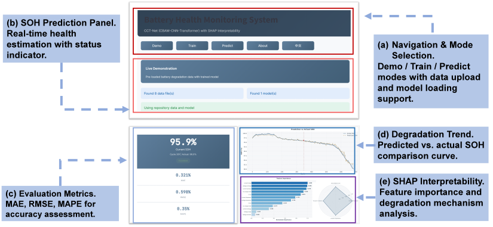

# Battery Health Monitoring Expert System

[](https://battery-health-monitoring-expert-system-crzz64eajisrvnvajxoont.streamlit.app/)

An interactive web-based system for lithium-ion battery State-of-Health (SOH) estimation using the CCT-Net (CNN-CBAM-Transformer) deep learning architecture with SHAP-based interpretability analysis.

## Overview


This repository contains the implementation of the battery health monitoring system described in:

> **Interpretable and Generalizable State-of-Health Estimation for Lithium-Ion Batteries Based on End-of-Charge Features**
> 
> Fuyuan Liang, Xing Zhou*,  Haiqing Yu, Tao Zhang, Yajie Liu*
> 
> National University of Defense Technology

**Live Demo:** [https://battery-health-monitoring-expert-system-crzz64eajisrvnvajxoont.streamlit.app/](https://battery-health-monitoring-expert-system-crzz64eajisrvnvajxoont.streamlit.app/)

## Features

- **Demo Mode**: Explore the system with pre-loaded battery degradation data and trained models
- **Train Mode**: Upload custom datasets and train CCT-Net models with configurable parameters
- **Predict Mode**: Real-time SOH estimation with evaluation metrics (MAE, RMSE, MAPE)
- **SHAP Analysis**: Feature importance visualization and degradation mechanism interpretation

## System Architecture

  

The system integrates:
- End-of-charge "fingerprint window" feature extraction
- CCT-Net (CNN-CBAM-Transformer) architecture for SOH prediction
- SHAP-based interpretability analysis linking predictions to degradation mechanisms

## Installation

### Option 1: Use Online Demo (Recommended)
Visit the [live demo](https://battery-health-monitoring-expert-system-crzz64eajisrvnvajxoont.streamlit.app/) directly.

### Option 2: Local Installation
```bash
git clone https://github.com/liangtongx234/Battery-Health-Monitoring-Expert-System.git
cd Battery-Health-Monitoring-Expert-System
pip install -r requirements.txt
streamlit run app_main.py
```

## Data Format

CSV files should contain the following columns:
- `CC Q` - Constant current charging capacity
- `CV Q` - Constant voltage charging capacity  
- `CC charge time` - Constant current charging time
- `CV charge time` - Constant voltage charging time
- `voltage entropy`, `voltage skewness`, `voltage kurtosis` - Voltage statistical features
- `current entropy`, `current skewness`, `current kurtosis` - Current statistical features
- `voltage slope`, `current slope` - Temporal gradient features
- `capacity` - Measured capacity (target)


## Citation

If you find this work useful, please cite:
```bibtex
@article{liang2025interpretable,
  title={Interpretable and Generalizable State-of-Health Estimation for Lithium-Ion Batteries Based on End-of-Charge Features},
  author={Liang, Fuyuan and Zhou, Xing and Yu, Haiqing and Zhang, Tao and Liu, Yajie},
  note={Submitted to Expert Systems with Applications},
  year={2026}
}
```

## License

This project is licensed under the MIT License.


